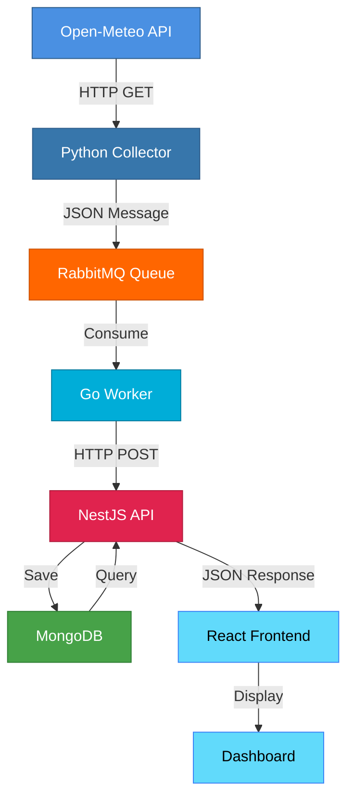
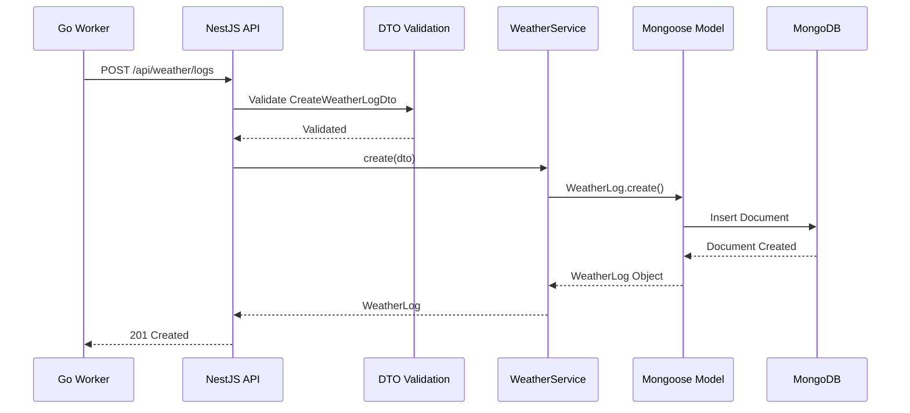
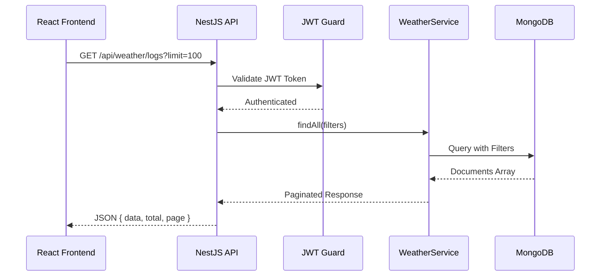
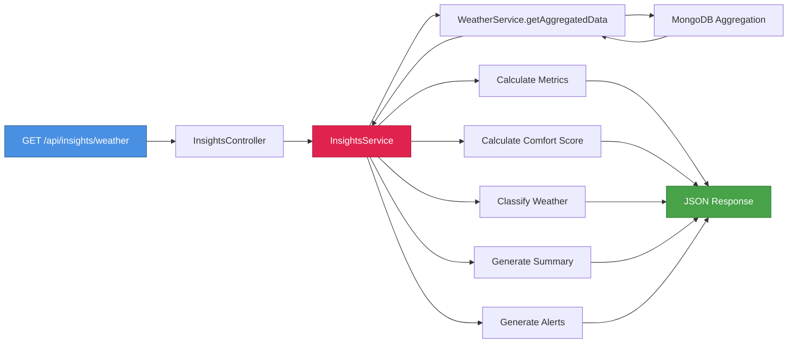
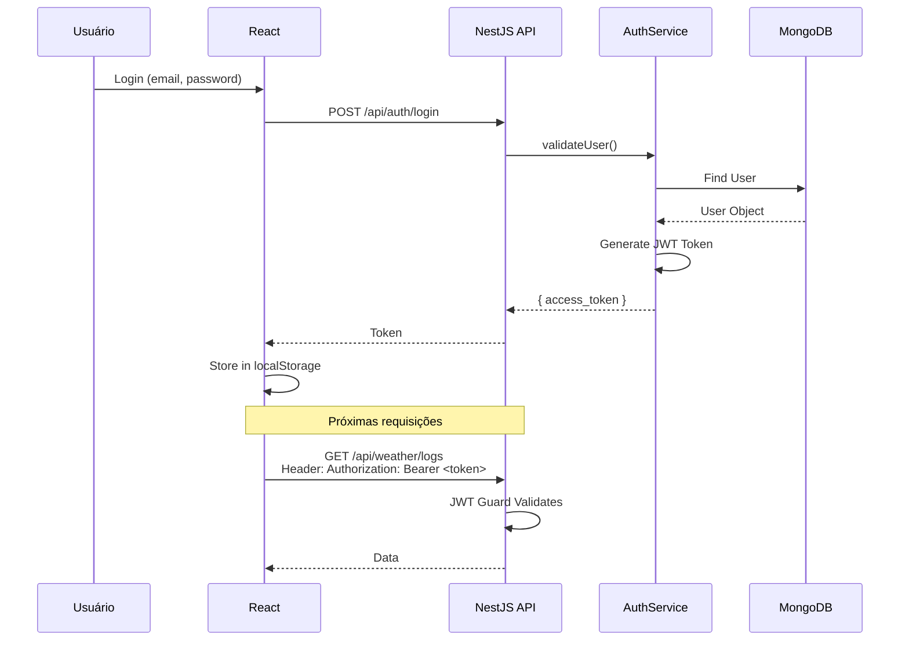
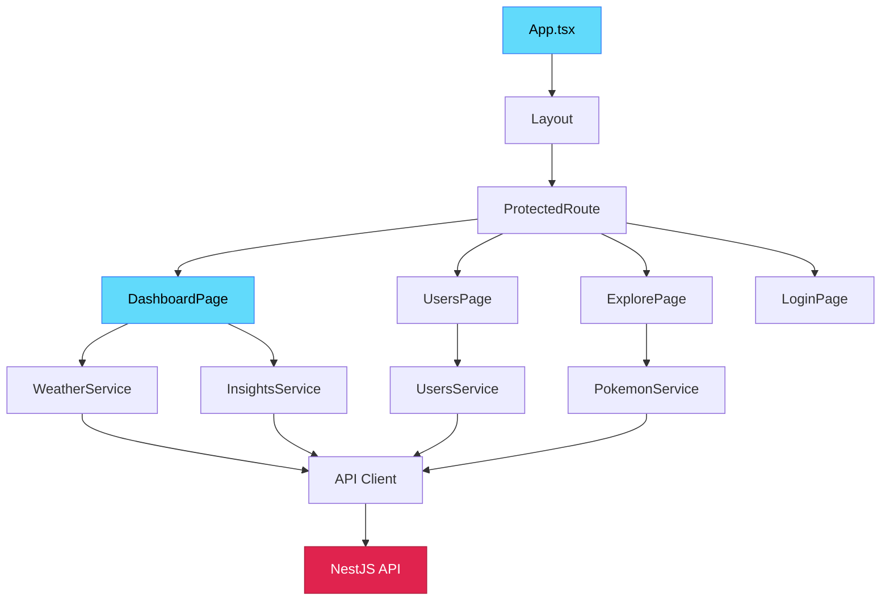
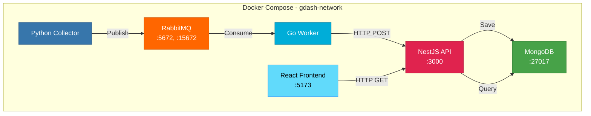
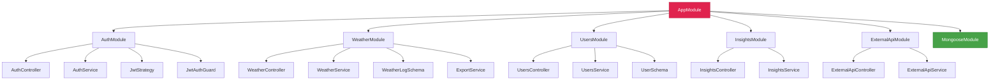

# 📊 Diagramas Visuais da Arquitetura

Este arquivo contém diagramas em formato Mermaid que podem ser renderizados em GitHub, GitLab ou outras ferramentas que suportam Mermaid.

---

## 🔄 Pipeline Principal de Dados



---

## 📥 Fluxo de Ingestão de Dados



---

## 📤 Fluxo de Consulta de Dados



---

## 🧠 Fluxo de Geração de Insights



---

## 🔐 Fluxo de Autenticação



---

## 🖥️ Arquitetura de Componentes Frontend



---

## 🐳 Infraestrutura Docker Compose



---

## 📊 Módulos NestJS



---

## 🔄 Fluxo Completo End-to-End

```mermaid
graph LR
    subgraph "Coleta"
        A1[Open-Meteo] --> A2[Python]
        A2 --> A3[RabbitMQ]
    end
    
    subgraph "Processamento"
        A3 --> B1[Go Worker]
        B1 --> B2[NestJS API]
        B2 --> B3[MongoDB]
    end
    
    subgraph "Visualização"
        B3 --> C1[NestJS API]
        C1 --> C2[React Frontend]
        C2 --> C3[Dashboard]
    end
    
    style A1 fill:#4A90E2,stroke:#2E5C8A,color:#fff
    style A2 fill:#3776AB,stroke:#2E5C8A,color:#fff
    style A3 fill:#FF6600,stroke:#CC5200,color:#fff
    style B1 fill:#00ADD8,stroke:#007A9E,color:#fff
    style B2 fill:#E0234E,stroke:#B01C3D,color:#fff
    style B3 fill:#47A248,stroke:#2E7D32,color:#fff
    style C1 fill:#E0234E,stroke:#B01C3D,color:#fff
    style C2 fill:#61DAFB,stroke:#3B82F6,color:#000
    style C3 fill:#61DAFB,stroke:#3B82F6,color:#000
```



---

## 📝 Como Visualizar os Diagramas

### No GitHub/GitLab
Os diagramas Mermaid são renderizados automaticamente quando você visualiza o arquivo `.md` no GitHub ou GitLab.

### Localmente
1. Use extensões do VS Code como "Markdown Preview Mermaid Support"
2. Use ferramentas online como [Mermaid Live Editor](https://mermaid.live/)
3. Use ferramentas como [Mermaid CLI](https://github.com/mermaid-js/mermaid-cli) para gerar imagens

### Gerar Imagens
```bash
# Instalar Mermaid CLI
npm install -g @mermaid-js/mermaid-cli

# Gerar imagem PNG
mmdc -i DIAGRAMAS.md -o diagramas.png

# Gerar imagem SVG
mmdc -i DIAGRAMAS.md -o diagramas.svg
```

---

**Nota:** Estes diagramas complementam os fluxogramas em texto do arquivo `FLUXOGRAMA_ARQUITETURA.md` e podem ser usados no vídeo explicativo ou na documentação.

