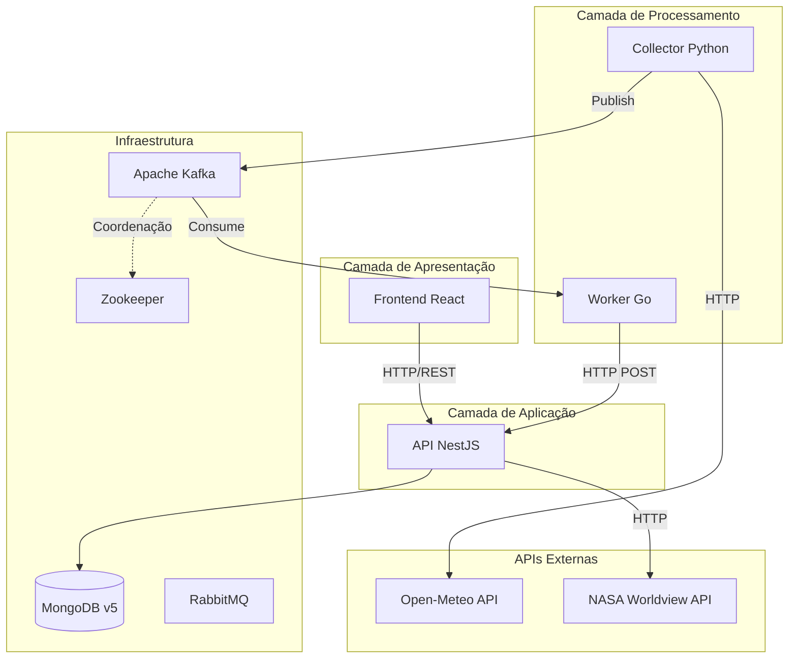
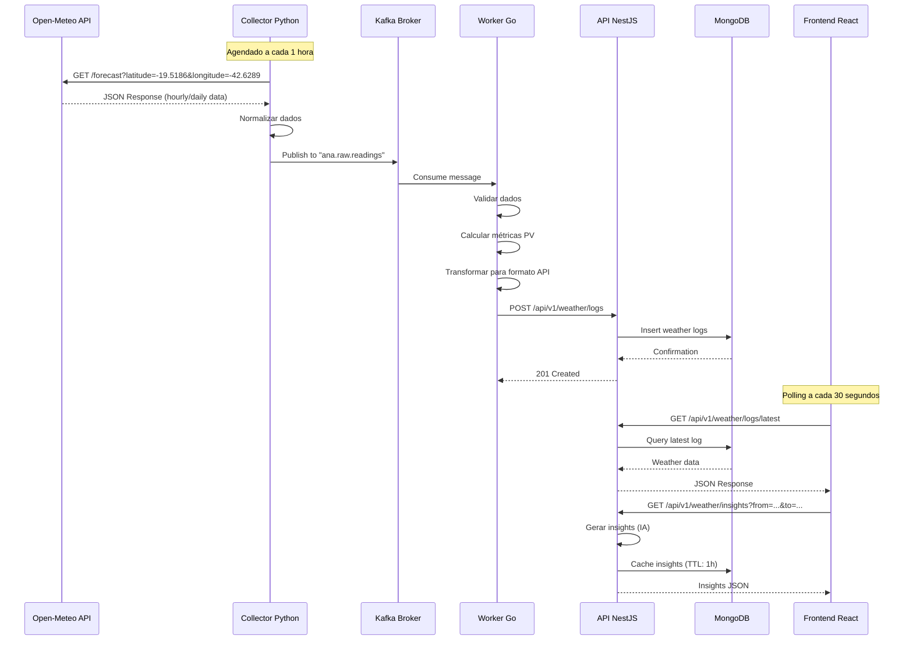

# GDASH - DASHBOARD CORONEL FABRICIANO - MG 

## Desenvolvido por: ***Wilker Junio Coelho Pimenta***

---

# Documentação Completa do Projeto

## Visão Geral

O **GDASH (Dashboard Coronel Fabriciano)** é uma solução completa de monitoramento climático e análise de energia solar desenvolvida como resposta ao desafio técnico do processo seletivo GDASH 2025/02. O sistema integra múltiplas tecnologias em uma arquitetura de microsserviços moderna, orientada a eventos e containerizada, proporcionando:

- ✅ **Coleta automatizada** de dados meteorológicos em tempo real
- ✅ **Processamento assíncrono** de alta performance para cálculo de métricas PV
- ✅ **Insights inteligentes** gerados por Sistema Especialista (IA)
- ✅ **Dashboard interativo** com visualizações em tempo real
- ✅ **Exportação de dados** em múltiplos formatos (CSV/XLSX)
- ✅ **Autenticação e autorização** com JWT
- ✅ **CRUD completo** de usuários

### 📹 Vídeo Explicativo

Assista ao vídeo de apresentação do projeto explicando a arquitetura, pipeline de dados, insights de IA e principais decisões técnicas:

🎥 **[Vídeo de Apresentação - YouTube](https://youtu.be/oUIVsIPLNvI)**

### Localização Monitorada
- **Cidade:** Coronel Fabriciano, MG, Brasil
- **Coordenadas:** Latitude: `-19.5186`, Longitude: `-42.6289`
- **Fuso Horário:** America/Sao_Paulo

---

## Arquitetura do Sistema

O projeto segue os princípios de **Clean Architecture** e **Arquitetura de Microsserviços**, garantindo:

- **Desacoplamento** entre serviços
- **Escalabilidade** horizontal
- **Resiliência** e tolerância a falhas
- **Manutenibilidade** e testabilidade

### Diagrama de Arquitetura Geral



### Componentes Principais

#### 1. **Collector (Python 3.11)**
- **Responsabilidade:** Coleta de dados meteorológicos brutos
- **Fonte de Dados:** Open-Meteo API (gratuita, sem necessidade de chave)
- **Frequência:** A cada 1 hora (configurável via `.env`)
- **Output:** Mensagens JSON publicadas no tópico Kafka `ana.raw.readings`
- **Arquitetura:** Clean Architecture com separação de camadas (Domain, Application, Infrastructure)

#### 2. **Worker (Go 1.21)**
- **Responsabilidade:** Processamento de alta performance e validação de dados
- **Tecnologia:** Go com Sarama (Kafka Client)
- **Input:** Consome mensagens do tópico `ana.raw.readings`
- **Processamento:**
  - Validação de dados
  - Cálculo de métricas PV (irradiância estimada, fatores de derating)
  - Normalização e transformação
- **Output:** Dados processados enviados para API NestJS via HTTP POST
- **Features:**
  - Retry com exponential backoff (3 tentativas)
  - Idempotência via UUID
  - Healthcheck endpoint (`/healthz`)

#### 3. **API (NestJS + Node.js 20)**
- **Responsabilidade:** Backend central, regras de negócio, autenticação e persistência
- **Arquitetura:** Clean Architecture
- **Camadas:**
  - **Domain:** Entidades e interfaces de repositórios
  - **Application:** Use cases (lógica de negócio)
  - **Infrastructure:** Implementações concretas (MongoDB, JWT, IA)
  - **Presentation:** Controllers e DTOs
- **Funcionalidades:**
  - Gestão de logs climáticos
  - Geração de Insights (IA)
  - CRUD de usuários
  - Exportação CSV/XLSX
  - Integração NASA (API pública paginada)
  - Autenticação JWT

#### 4. **Frontend (React 19 + TypeScript)**
- **Responsabilidade:** Interface do usuário e dashboard interativo
- **Tecnologias:**
  - React 19 com TypeScript
  - Vite (build tool)
  - Tailwind CSS (estilização)
  - ShadCN/UI (componentes)
  - Chart.js (gráficos)
  - React Router (roteamento)
- **Features:**
  - Dashboard com dados em tempo real
  - Visualização de insights de IA
  - Background animado na tela de login
  - CRUD de usuários
  - Exportação de dados
  - Integração NASA

---

## Pipeline de Dados

O fluxo de dados opera de forma contínua e assíncrona, garantindo baixa latência e alta disponibilidade.

### Diagrama de Sequência - Pipeline Completo



### Fluxo Detalhado

1. **Coleta (Python Collector)**
   - Requisição HTTP para Open-Meteo API
   - Extração de dados meteorológicos (temperatura, umidade, vento, precipitação, etc.)
   - Normalização para formato padronizado
   - Publicação no Kafka (tópico: `ana.raw.readings`)

2. **Processamento (Go Worker)**
   - Consumo de mensagens do Kafka
   - Validação e sanitização dos dados
   - Cálculo de métricas PV:
     - `estimated_irradiance`: Irradiância solar estimada (W/m²)
     - `temp_effect_factor`: Fator de efeito de temperatura
     - `soiling_risk`: Risco de sujeira nas placas
     - `wind_derating_flag`: Flag de derating por vento extremo
   - Envio para API NestJS via HTTP POST

3. **Persistência (NestJS API)**
   - Recebimento de dados processados
   - Validação via DTOs
   - Persistência no MongoDB
   - Geração automática de insights (opcional)

4. **Visualização (Frontend React)**
   - Polling periódico (30 segundos) para dados atualizados
   - Requisição de insights sob demanda
   - Renderização de gráficos e cards
   - Exportação de dados (CSV/XLSX)

---

## Stack Tecnológica Completa

### Backend & Processamento

| Componente | Tecnologia | Versão | Propósito |
|------------|------------|--------|-----------|
| **API** | NestJS | 10.3.0 | Framework Node.js |
| **Runtime** | Node.js | 20.x | JavaScript runtime |
| **Linguagem** | TypeScript | 5.3.3 | Tipagem estática |
| **Banco de Dados** | MongoDB | 5.x | Banco NoSQL |
| **ODM** | Mongoose | 8.0.3 | Modelagem de dados |
| **Autenticação** | JWT (Passport) | 4.0.1 | Tokens seguros |
| **Criptografia** | bcryptjs | 2.4.3 | Hash de senhas |
| **Exportação** | ExcelJS | 4.4.0 | Geração XLSX |

### Worker & Coleta

| Componente | Tecnologia | Versão | Propósito |
|------------|------------|--------|-----------|
| **Worker** | Go | 1.21 | Alta performance |
| **Kafka Client** | Sarama | 1.42.1 | Consumo Kafka |
| **Collector** | Python | 3.11 | Coleta de dados |
| **HTTP Client** | Requests | 2.31.0 | Requisições HTTP |
| **Kafka Producer** | kafka-python | 2.0.2 | Publicação Kafka |

### Frontend

| Componente | Tecnologia | Versão | Propósito |
|------------|------------|--------|-----------|
| **Framework** | React | 19.2.0 | Interface de usuário |
| **Build Tool** | Vite | 7.2.4 | Build rápido |
| **Linguagem** | TypeScript | 5.9.3 | Tipagem estática |
| **Estilização** | Tailwind CSS | 3.4.18 | Utility-first CSS |
| **Componentes** | ShadCN/UI | Custom | Design system |
| **Gráficos** | Chart.js | 4.5.1 | Visualizações |
| **Roteamento** | React Router | 7.9.6 | Navegação |
| **HTTP Client** | Axios | 1.13.2 | Requisições HTTP |
| **Formulários** | React Hook Form | 7.66.1 | Gestão de forms |

### Infraestrutura

| Componente | Tecnologia | Versão | Propósito |
|------------|------------|--------|-----------|
| **Orquestração** | Docker Compose | 2.0+ | Containers |
| **Message Broker** | Apache Kafka | 7.5.0 | Filas de mensagens |
| **Coordenação** | Zookeeper | 7.5.0 | Coordenação Kafka |
| **Message Queue** | RabbitMQ | 3-management | Fila alternativa |
| **Web Server** | Nginx | Latest | Servir frontend |

### APIs Externas

| API | Tipo | Propósito |
|-----|------|-----------|
| **Open-Meteo** | Gratuita | Dados meteorológicos |
| **NASA Worldview** | Gratuita | Imagens de satélite |

---

## 🗄️ Banco de Dados (MongoDB)

O MongoDB armazena três coleções principais:

### 1. **weather_logs**
Armazena os logs climáticos processados pelo Worker.

```typescript
{
  _id: ObjectId,
  timestamp: Date,
  location: {
    latitude: Number,
    longitude: Number,
    city: String,
    timezone: String
  },
  temperature: Number,          // °C
  humidity: Number,              // %
  windSpeed: Number,             // m/s
  windDirection: Number,         // graus
  precipitation: Number,         // mm
  cloudCover: Number,            // %
  condition: String,             // "sunny", "cloudy", "rainy"
  
  // Métricas PV calculadas pelo Worker
  pvMetrics: {
    estimatedIrradiance: Number, // W/m²
    tempEffectFactor: Number,
    soilingRisk: Number,
    windDeratingFlag: Boolean
  },
  
  source: String,                // "openmeteo"
  createdAt: Date,
  updatedAt: Date
}
```

### 2. **users**
Armazena os usuários do sistema.

```typescript
{
  _id: ObjectId,
  email: String,                 // único
  password: String,              // hash bcrypt
  name: String,
  role: String,                  // "admin" | "user"
  createdAt: Date,
  updatedAt: Date
}
```

### 3. **insights**
Cache de insights gerados pela IA (TTL: 1 hora).

```typescript
{
  _id: ObjectId,
  from: Date,
  to: Date,
  summary: String,               // Resumo textual
  comfortScore: Number,          // 0-100
  pvProductionScore: Number,     // 0-100
  
  statistics: {
    avgTemperature: Number,
    avgHumidity: Number,
    totalPrecipitation: Number
  },
  
  pvMetrics: {
    highSoilingRisk: Boolean,
    consecutiveCloudyDays: Number,
    heatDerating: Boolean,
    windDerating: Boolean,
    estimatedProductionImpact: Number  // %
  },
  
  alerts: [String],              // Alertas contextuais
  trend: String,                 // "rising" | "falling" | "stable"
  
  expiresAt: Date,               // TTL
  createdAt: Date
}
```

---

## Sistema de IA (Insights)

O sistema utiliza uma abordagem de **Sistema Especialista**, combinando:

1. **Regras Heurísticas** baseadas em conhecimento do domínio:
   - Cálculo de risco de sujeira (soiling)
   - Detecção de dias consecutivos nublados
   - Cálculo de derating por temperatura alta
   - Detecção de vento extremo

2. **Análise Estatística**:
   - Médias e desvios padrão
   - Detecção de tendências (rising/falling/stable)
   - Classificação probabilística de dias

3. **Geração de Texto Contextual**:
   - Resumos legíveis por humanos
   - Alertas contextuais
   - Pontuações de 0-100

### Por que esta abordagem?

-  **Transparência:** Regras explicáveis
-  **Performance:** Alta velocidade (< 100ms)
-  **Manutenibilidade:** Fácil ajuste de regras
- **Sem dependências externas:** Não requer APIs de IA

### Localização no Código

```
api-nest/src/infra/ai/
├── rules/              # Regras heurísticas
│   ├── soiling-risk.rule.ts
│   ├── consecutive-cloudy-days.rule.ts
│   ├── heat-derating.rule.ts
│   └── wind-derating.rule.ts
├── analyzers/          # Análise estatística
│   ├── statistical.analyzer.ts
│   ├── trend.analyzer.ts
│   └── day-classifier.analyzer.ts
├── generators/         # Geração de texto
│   └── text.generator.ts
└── scorers/            # Pontuações
    ├── comfort.scorer.ts
    └── pv-production.scorer.ts
```

---

## Estrutura do Projeto

```
desafio-gdash-2025-02/
├── api-nest/                      # API NestJS
│   ├── src/
│   │   ├── domain/                # Entidades e interfaces
│   │   ├── application/           # Use cases
│   │   ├── infra/                 # Implementações (DB, Auth, AI)
│   │   ├── presentation/          # Controllers e DTOs
│   │   └── modules/               # Módulos NestJS
│   ├── database/seed/             # Seeds
│   └── Dockerfile
│
├── colletor-python/               # Collector Python
│   ├── src/
│   │   ├── domain/                # Entidades
│   │   ├── application/           # Use cases
│   │   ├── infra/                 # HTTP, Kafka
│   │   └── shared/                # Config, Logger
│   ├── tests/                     # Testes
│   └── Dockerfile
│
├── worker-go/                     # Worker Go
│   ├── cmd/worker/                # Entry point
│   ├── domain/                    # Entidades e interfaces
│   ├── application/               # Services e use cases
│   ├── infra/                     # HTTP, Kafka
│   ├── internal/                  # Config, Logger
│   ├── tests/                     # Testes
│   └── Dockerfile
│
├── frontend-react/                # Frontend React
│   ├── src/
│   │   ├── app/                   # Config API, Routes
│   │   ├── components/            # Componentes reutilizáveis
│   │   ├── pages/                 # Páginas
│   │   ├── contexts/              # Context API
│   │   ├── hooks/                 # Custom hooks
│   │   └── utils/                 # Utilitários
│   └── Dockerfile
│
├── docs/                          # Documentação
│   ├── ARCHITECTURE.md            # Arquitetura detalhada
│   ├── API.md                     # Referência de API
│   ├── RUNNING.md                 # Guia de execução
│   ├── TESTING.md                 # Guia de testes
│   └── ARCHIVE/                   # Histórico
│
├── docker-compose.yml             # Orquestração
├── env.example                    # Template de variáveis
├── start.sh                       # Script de inicialização
└── README.md                      # Este arquivo
```

---

## 🚀 Guia de Execução Rápida

### Pré-requisitos

- Docker Engine (20.10+) ou Docker Desktop
- Docker Compose (v2.0+)
- Git
- 8GB RAM mínimo recomendado

### Inicialização Automática (Linux/Mac)

```bash
# 1. Clone o repositório
git clone <repository-url>
cd desafio-gdash-2025-02

# 2. Configure as variáveis de ambiente
cp env.example .env
# Edite .env se necessário

# 3. Execute o script de inicialização
chmod +x start.sh
./start.sh
```

O script `start.sh` realiza automaticamente:
-  Limpeza de containers antigos
-  Inicialização da infraestrutura (Kafka, MongoDB)
-  Inicialização das aplicações
-  Seed do banco de dados (usuário admin)
-  Verificação de healthchecks

### Inicialização Manual (Windows)

```powershell
# 1. Clone e configure
git clone <repository-url>
cd desafio-gdash-2025-02
copy env.example .env

# 2. Inicie os serviços
docker compose up -d

# 3. Execute o seed manualmente
docker compose exec api node dist/database/seed/users.seed.js
```

### Acessando o Sistema

Após a inicialização, os serviços estarão disponíveis em:

| Serviço | URL | Descrição |
|---------|-----|-----------|
| **Frontend** | http://localhost:5173 | Dashboard principal |
| **API** | http://localhost:3000/api/v1 | Backend REST API |
| **Collector Health** | http://localhost:8080/healthz | Status do collector |
| **Worker Health** | http://localhost:8081/healthz | Status do worker |
| **RabbitMQ UI** | http://localhost:15672 | Interface RabbitMQ |

### Credenciais Padrão

```
Email: admin@example.com
Senha: 123456
```

### Parando o Sistema

```bash
# Parar todos os serviços
docker compose down

# Parar e remover volumes (reset completo)
docker compose down -v
```

---

## Endpoints da API

### Base URL
```
http://localhost:3000/api/v1
```

### Autenticação

| Método | Endpoint | Descrição | Auth |
|--------|----------|-----------|------|
| POST | `/auth/login` | Login e obtenção de JWT | Não |
| POST | `/auth/register` | Registro de novo usuário | Não |

### Dados Climáticos

| Método | Endpoint | Descrição | Auth |
|--------|----------|-----------|------|
| GET | `/weather/logs` | Lista logs (paginação) | ✅ |
| GET | `/weather/logs/latest` | Última leitura | ✅ |
| GET | `/weather/precipitation/24h` | Chuva acumulada 24h | ✅ |
| POST | `/weather/logs` | Criar log (interno - usado pelo Worker Go) | Não |
| GET | `/weather/health` | Healthcheck | Não |

### Insights (IA)

| Método | Endpoint | Descrição | Auth |
|--------|----------|-----------|------|
| GET | `/weather/insights?from=...&to=...` | Buscar insights | ✅ |
| POST | `/weather/insights` | Gerar insights | ✅ |

### Usuários

| Método | Endpoint | Descrição | Auth |
|--------|----------|-----------|------|
| GET | `/users` | Listar usuários | ✅ Admin |
| GET | `/users/:id` | Detalhes do usuário | ✅ Admin |
| PUT | `/users/:id` | Atualizar usuário | ✅ Admin |
| DELETE | `/users/:id` | Remover usuário | ✅ Admin |

### Exportação

| Método | Endpoint | Descrição | Auth |
|--------|----------|-----------|------|
| GET | `/weather/export.csv` | Download CSV | ✅ |
| GET | `/weather/export.xlsx` | Download XLSX | ✅ |

### NASA (Opcional)

| Método | Endpoint | Descrição | Auth |
|--------|----------|-----------|------|
| GET | `/nasa?page=...&limit=...` | Listar imagens | ✅ |

> 💡 **Nota:** Para documentação detalhada de cada endpoint, consulte [docs/API.md](docs/API.md)

---

## Checklist de Funcionalidades

### Requisitos Obrigatórios

- [x] **Python coleta dados de clima** (Open-Meteo)  
- [x] **Python envia dados para a fila** (Kafka)  
- [x] **Worker Go consome a fila** e envia para a API NestJS  
- [x] **API NestJS:**
  - [x] Armazena logs de clima em MongoDB  
  - [x] Expõe endpoints para listar dados  
  - [x] Gera/retorna insights de IA (endpoint próprio)  
  - [x] Exporta dados em CSV/XLSX  
  - [x] Implementa CRUD de usuários + autenticação  
  - [x] Integração com API pública paginada (NASA)  
- [x] **Frontend React:**
  - [x] Dashboard de clima com dados reais  
  - [x] Exibição de insights de IA  
  - [x] CRUD de usuários + login  
  - [x] Background animado na tela de login  
  - [x] Página consumindo API pública paginada (NASA)  
- [x] **Docker Compose** sobe todos os serviços  
- [x] **Código em TypeScript** (backend e frontend)  
- [x] **Script de inicialização** automatizado (start.sh)  
- [x] **README completo** com instruções de execução  
- [x] **Logs e tratamento de erros** básicos em cada serviço  

### Requisitos Pendentes

- [x] **Vídeo explicativo** (máx. 5 minutos) - [Assistir no YouTube](https://youtu.be/oUIVsIPLNvI)  
- [ ] **Pull Request** via branch com seu nome completo - **Pendente ação do desenvolvedor**  

### Bônus Implementados

- [x] Logs detalhados por serviço
- [x] Dashboard com múltiplos tipos de gráfico
- [x] Integração com API pública (NASA)
- [x] Background animado no login
- [x] Sistema de insights com IA

---

## Documentação Adicional

Para informações detalhadas sobre aspectos específicos do projeto, consulte:

- **[docs/ARCHITECTURE.md](docs/ARCHITECTURE.md)** - Arquitetura detalhada do sistema
- **[docs/API.md](docs/API.md)** - Referência completa da API REST
- **[docs/RUNNING.md](docs/RUNNING.md)** - Guia detalhado de execução
- **[docs/TESTING.md](docs/TESTING.md)** - Guia de testes automatizados
- **[docs/ARCHIVE/IMPLEMENTACAO_IA_INSIGHTS.md](docs/ARCHIVE/IMPLEMENTACAO_IA_INSIGHTS.md)** - Documentação da implementação de IA

---

## Decisões Técnicas Importantes

### Por que Clean Architecture?
- Separação clara de responsabilidades
- Facilita testes unitários
- Independência de frameworks
- Manutenibilidade a longo prazo

### Por que Kafka em vez de RabbitMQ?
- Melhor para streams de dados
- Alta throughput
- Retenção de mensagens
- Particionamento e escalabilidade

### Por que Sistema Especialista em vez de ML?
- Transparência e explicabilidade
- Performance superior (< 100ms)
- Sem necessidade de treinamento
- Fácil ajuste de regras de negócio

### Por que MongoDB?
- Flexibilidade de schema
- Boa performance para dados de série temporal
- Integração nativa com Node.js
- Suporte a índices compostos

---

## Contribuindo

Este projeto foi desenvolvido como resposta ao desafio técnico do processo seletivo GDASH 2025/02.

---

## Licença

Este projeto foi desenvolvido exclusivamente para fins de avaliação técnica.

---

