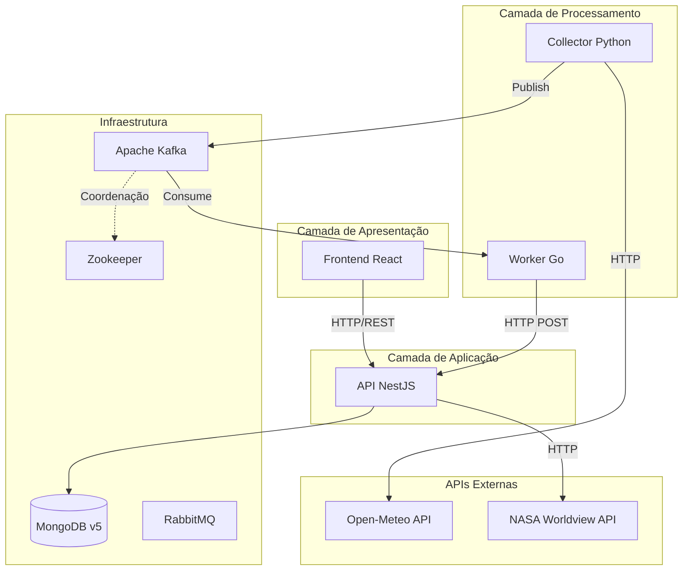
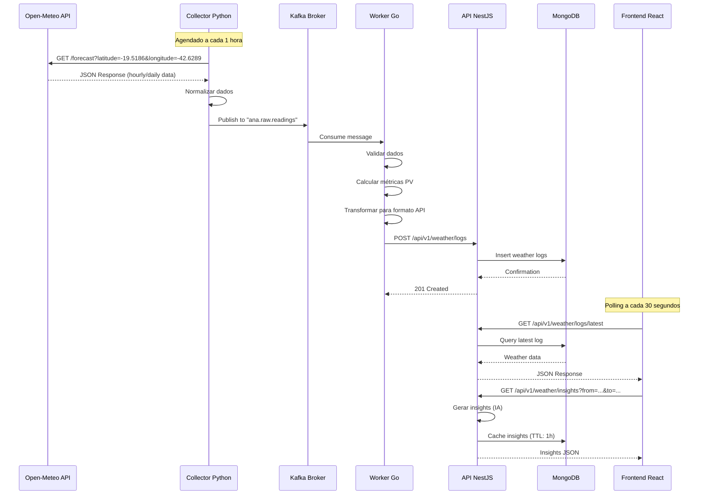

# Desafio para o processo seletivo GDASH 2025/02

Repositório destinado aos interessados em participar do processo seletivo GDASH 2025/02.

## Sobre o GDASH

No ramo da produção de energia fotovoltaica, há a modalidade de produção compartilhada. Nessa modalidade, diferentes pessoas investem na construção de uma mesma usina fotovoltaica e dividem o retorno finaceiro referente à energia gerada pela usina.

Acreditamos que as energias renováveis terão um lugar dominante em nossa economia pelo resto de nossas vidas. Trabalhamos no sentido de ampliar o impacto positivo que as energias renováveis podem ter no meio ambiente e nas nossas vidas. O sucesso da GDASH é resultado de nossa equipe apaixonada, juntamente com nosso compromisso de oferecer a melhor solução.

Sabemos que negócios enfrentam desafios únicos e por isso oferecemos soluções turnkey, customizadas, economicamente viáveis e seguras.

Somos uma startup em estágio de crescimento e você trabalhará diretamente com os fundadores, ajudando a definir a visão, o produto e a experiência do usuário.

<p align="left">
  <a href="https://www.linkedin.com/company/gdash/">
    
  </a>
  <a href="https://gdash.io/">
    
  </a>
</p>

## Sobre a vaga

Já pensou em potencializar o setor que mais cresce na galáxia e trabalhar com uma solução que utiliza tecnologia web de ponta, altamente distribuída com foco em performance e disponibilidade? 👀

Os desenvolvedores GDASH são responsáveis por criar e manter aplicações para clientes internos e externos, prover soluções escaláveis, resilientes e altamente disponíveis que sustentem picos de acesso além de atuar como referência técnica e tutores de outros desenvolvedores.

Procuramos por pessoas dinâmicas e que queiram estar aprendendo sempre. Nossa equipe é jovem, motivada e estamos sempre em busca de soluções criativas para alcançar os resultados que nossos clientes esperam. Se você tem esse perfil, é autoconfiante, autodidata e tem facilidade para lidar com desafios diários, essa vaga é para você!

# 🚀 O Desafio

## 🧭 Visão geral
O objetivo deste desafio é desenvolver uma aplicação **full-stack** moderna que integre múltiplas linguagens e serviços, com foco em **integração entre sistemas, dados reais e uso de IA**.

Você deverá construir um sistema que:

1. **Coleta dados climáticos** (via **Open-Meteo** ou **OpenWeather**) da sua **cidade/localização**;  
2. **Envia esses dados periodicamente** para uma **fila** (Message Broker, como RabbitMQ ou até Redis), processada por um **worker em Go**;  
3. **Armazena os dados** em uma **API NestJS** com **MongoDB**;  
4. **Exibe um Dashboard** no frontend (React + Vite + Tailwind + shadcn/ui) com os dados coletados;  
5. Gera **insights baseados em IA** a partir das informações climáticas — podendo ser gerados automaticamente, sob demanda, ou de qualquer outra forma que você julgar adequada;  
6. Inclui:
   - **CRUD de usuários** (com autenticação e usuário padrão);
   - **Página opcional** de integração com uma **API pública paginada** (ex.: PokéAPI, Star Wars API, etc.);
   - **Exportação de dados** em **CSV/XLSX**;  
7. Toda a solução deve rodar via **Docker Compose**.

> ⚙️ **Observação importante:**  
> Os nomes de **endpoints, coleções, entidades, variáveis, bibliotecas e estruturas** usados neste documento são **apenas exemplos ilustrativos**.  
> Você pode (e deve) adotar as convenções e estruturas que considerar mais adequadas, desde que a **funcionalidade final** seja mantida.

---

## 🧩 Stack obrigatória

- **Frontend:** React + Vite + Tailwind + [shadcn/ui](https://ui.shadcn.com)  
- **Backend (API):** NestJS (TypeScript)  
- **Banco de dados:** MongoDB (Atlas ou container)  
- **Fila:** Go + Message Broker (`RabbitMQ`, `Redis`, etc.)  
- **Coleta de dados:** Python (`requests`, `httpx`, `pandas`, etc.)  
- **APIs externas:**
  - Clima (obrigatória): [Open-Meteo](https://open-meteo.com/) ou [OpenWeather](https://openweathermap.org/)
  - Opcional: qualquer API pública com **paginação**, por exemplo:
    - [PokéAPI](https://pokeapi.co/)
    - [SWAPI (Star Wars API)](https://swapi.dev/)
- **Infra:** Docker / Docker Compose  
- **Linguagem base:** **TypeScript obrigatório** (frontend e backend)

---

## ⚙️ Escopo funcional

### 1️⃣ Coleta de dados (Python → Fila)

O serviço em **Python** será responsável por:

- Buscar periodicamente (ex.: a cada 1 hora) dados da **previsão do tempo** da sua cidade/localização;  
- Extrair informações relevantes, como (exemplos):
  - Temperatura
  - Umidade
  - Velocidade do vento
  - Condição do céu
  - Probabilidade de chuva  
- Enviar os dados normalizados para uma **fila** em formato **JSON**.

> 🔹 Estrutura do JSON, nomes de campos e cron/intervalo são **livres** — podem ser adaptados conforme sua arquitetura.

O Python é o **produtor dos dados meteorológicos**. A camada de IA pode ser implementada em Python, no NestJS ou em outro serviço, desde que integrada.

---

### 2️⃣ Fila (Go + Message Broker)

Implemente um **worker em Go**, responsável por:

- Consumir mensagens da fila;  
- Validar e transformar os dados, se necessário;  
- Enviar os registros para a **API NestJS** (por exemplo, um endpoint como `POST /api/weather/logs`);  
- Confirmar as mensagens com **ack/nack**, implementar **retry básico**;  
- Registrar logs das operações principais.

> 📘 **Observação:**  
> O nome do endpoint, o body do JSON e a estrutura de erro são **apenas exemplos** neste README.  
> Você pode definir o contrato de comunicação da forma que achar melhor, desde que o fluxo Python → Message Broker → Go → NestJS funcione corretamente.

Bibliotecas sugeridas (não obrigatórias):

- `github.com/rabbitmq/amqp091-go`  
- `encoding/json`  
- `net/http`  

---

### 3️⃣ API (NestJS + MongoDB)

A API em **NestJS** será o núcleo do sistema, responsável por:

- Receber e armazenar os dados de clima;  
- Expor endpoints para consumo pelo frontend;  
- Orquestrar ou acionar a camada de IA;  
- Gerenciar usuários.

#### a) Dados de clima

Responsabilidades sugeridas:

- Receber registros vindos do worker Go;  
- Armazenar em uma coleção no MongoDB (ex.: `weather_logs`);  
- Expor endpoints, como (exemplos):
  - `GET /api/weather/logs` — listar registros climáticos;
  - `GET /api/weather/export.csv` — exportar CSV;
  - `GET /api/weather/export.xlsx` — exportar XLSX;
  - `GET ou POST /api/weather/insights` — gerar e/ou retornar insights de IA.

Os **insights de IA** podem ser:

- Gerados automaticamente quando novos dados são inseridos;  
- Calculados sob demanda (quando o frontend solicitar);  
- Atualizados de forma agendada.

> 💡 O importante é que o sistema seja capaz de **usar os dados históricos de clima** para produzir informações mais ricas, não apenas listar valores crus.

---

#### b) Usuários

- Implementar um **CRUD completo de usuários** (ex.: `/api/users`);  
- Implementar autenticação (JWT ou similar);  
- Criar um **usuário padrão** automaticamente na inicialização (ex.: `admin@example.com / 123456` — valores podem ser configuráveis via `.env`).

---

#### c) Integração com API pública (opcional)

Como parte opcional do desafio, implemente uma funcionalidade que consuma uma **API pública com paginação**, por exemplo:

- [PokéAPI](https://pokeapi.co/) — listagem de Pokémons + detalhe de um Pokémon;  
- [SWAPI](https://swapi.dev/) — listagem de personagens, planetas ou naves + detalhe.

Sugestão de funcionalidades (opcionais):

- Endpoint no backend que consome a API externa — o frontend não chama a API pública diretamente;  
- Paginação simples;  
- Endpoint de detalhe de um item (ex.: Pokémon, personagem, planeta).

> 🌍 Tanto o nome dos endpoints quanto o desenho das rotas ficam **totalmente a seu critério**.

---

## 🖥️ Frontend (React + Vite + Tailwind + shadcn/ui)

A aplicação frontend deve ser construída com **React + Vite**, estilizada com **Tailwind** e utilizando componentes do **shadcn/ui**.

Ela deve ter, no mínimo, **essas áreas de funcionalidade**:

---

### 🌦️ 1. Dashboard de Clima

O Dashboard será a **página principal** do sistema, exibindo:

- **Dados reais de clima** da sua cidade/localização, obtidos via pipeline Python → Go → NestJS → MongoDB;  
- **Insights de IA** gerados a partir desses dados.

A forma de exibir essas informações é **livre**.

Você pode, por exemplo, incluir:

- **Cards principais** (exemplos):
  - Temperatura atual  
  - Umidade atual  
  - Velocidade do vento  
  - Condição (ensolarado, nublado, chuvoso, etc.)  

- **Gráficos** (exemplos):
  - Temperatura ao longo do tempo;  
  - Probabilidade de chuva ao longo do tempo;  

- **Tabela de registros** (exemplo):
  - Data/hora  
  - Local  
  - Condição  
  - Temperatura  
  - Umidade  
  - Botões para exportar **CSV/XLSX** (integração com os endpoints do backend).

- **Insights de IA** (forma livre), como:
  - Texto explicativo (“Alta chance de chuva nas próximas horas”);  
  - Cards com alertas (“Calor extremo”, “Clima agradável”);  
  - Gráficos ou visualizações adicionais.

> 💡 Tudo acima são **exemplos ilustrativos**.  
> O requisito é: o Dashboard deve **mostrar os dados de clima da região + insights de IA**, mas você decide **como** isso será exibido (layout, tipos de gráfico, componentes etc.).

---

### 🌐 2. Página opcional – API pública paginada

Uma página (por exemplo, `/explorar`) consumindo a funcionalidade opcional do backend que integra com uma API pública paginada.

Exemplos de UX (apenas sugestões):

- Lista de Pokémons com paginação + página de detalhes de um Pokémon;  
- Lista de personagens de Star Wars com paginação + detalhes de um personagem.

---

### 👤 3. Usuários

Requisitos para a parte de usuários:

- Tela de **login**;  
- Rotas protegidas (somente usuário autenticado acessa o Dashboard);  
- CRUD de usuários (listar, criar, editar, remover);  
- Uso de componentes do **shadcn/ui** (Button, Input, Table, Dialog, Toast, etc.);  
- Feedback visual adequado (loading, erro, sucesso).

---

## 📁 Exportação de dados

- O backend deve expor endpoints para exportar dados de clima em **CSV** e **XLSX**;  
- O frontend deve oferecer botões no Dashboard para fazer o download desses arquivos.

---

## 💡 Ideias de insights (para `/api/weather/insights` ou similar)

A forma de aplicar IA é livre. Algumas ideias possíveis:

- Cálculo de média de temperatura e umidade em determinados períodos;  
- Detecção de tendência (temperaturas subindo ou caindo);  
- Pontuação de conforto climático (0–100);  
- Classificação do dia: “frio”, “quente”, “agradável”, “chuvoso”;  
- Alertas: “Alta chance de chuva”, “Calor extremo”, “Frio intenso”;  
- Geração de resumos em texto (ex.: “Nos últimos 3 dias, a temperatura média foi de 28°C, com alta umidade e tendência de chuva no fim da tarde.”).

> 🔍 Os exemplos acima são **sugestões inspiracionais**.  
> O que será implementado (e em qual serviço) fica a seu critério, desde que seja **coerente com os dados de clima**.

---

## 🧠 Critérios de avaliação

- **Funcionalidade completa:** pipeline Python → Message Broker → Go → NestJS → MongoDB → Frontend;  
- **Clareza de arquitetura:** organização de pastas, camadas e responsabilidades;  
- **Qualidade de código:** tipagem, legibilidade, padrões adotados;  
- **Integração entre serviços:** comunicação estável e bem tratada;  
- **Boas práticas:** validação, tratamento de erros, logs, eslint/prettier;  
- **UX:** experiência de uso do Dashboard e das telas;  
- **Criatividade:** na forma de mostrar dados e insights;  
- **Documentação:** README claro, com passos de execução e configuração;  
- **Uso correto do Docker Compose** para subir tudo.

**Bônus (não obrigatório):**

- Logs detalhados por serviço;  
- CI (lint/test) configurado;  
- Dashboard com filtros, múltiplos tipos de gráfico;  
- Deploy em ambiente gratuito (Railway, Render, etc.);  
- Testes automatizados (unitários e/ou e2e).

---

## ⚠️ Regras

- Respeitar termos de uso das APIs utilizadas (Open-Meteo/OpenWeather, PokéAPI, SWAPI, etc.);  
- Não coletar ou armazenar dados pessoais sensíveis;  
- Usar intervalos razoáveis para chamadas às APIs externas;  
- Focar em **integração, clareza e coesão**, não apenas em adicionar complexidade;  
- Você é livre para:
  - Renomear endpoints;
  - Alterar nomes de coleções;
  - Mudar estruturas de diretórios;
  - Escolher bibliotecas auxiliares — desde que a proposta do desafio seja atendida.

---

## 📹 Vídeo obrigatório

Grave um vídeo de **até 5 minutos** explicando:

- Arquitetura geral da aplicação;  
- Pipeline de dados (Python → Message Broker → Go → NestJS → Frontend);  
- Como os insights de IA são gerados e exibidos;  
- Principais decisões técnicas;  
- Demonstração rápida da aplicação rodando via Docker Compose.

O vídeo deve ser enviado via:

- **YouTube (não listado)**.

Inclua o link no README e/ou na descrição do Pull Request.

---

## 🧪 Entrega

A entrega deve ser feita via **Pull Request**, em uma **branch com o seu nome completo**, por exemplo:

- `joao-silva`  
- `maria-fernanda-souza`

O Pull Request deve conter:

- Código do **backend (NestJS)**;  
- Código do **frontend (Vite)**;  
- Código **Python** (coleta de clima);  
- Código **Go** (worker da fila);  
- `docker-compose.yml` com todos os serviços (API, frontend, banco, Message Broker, etc.);  
- Arquivo `.env.example` com todas as variáveis necessárias;  
- Link do vídeo explicativo (YouTube não listado);  
- README com:
  - Como rodar tudo via Docker Compose;  
  - Como rodar o serviço Python;  
  - Como rodar o worker Go;  
  - URLs principais (API, frontend, Swagger, etc.);  
  - Usuário padrão (login/senha) para acesso inicial.

---

## ✅ Checklist rápido

- [x] Python coleta dados de clima (Open-Meteo)  
- [x] Python envia dados para a fila (Kafka)  
- [x] Worker Go consome a fila e envia para a API NestJS  
- [x] API NestJS:
  - [x] Armazena logs de clima em MongoDB  
  - [x] Expõe endpoints para listar dados  
  - [x] Gera/retorna insights de IA (endpoint próprio)  
  - [x] Exporta dados em CSV/XLSX  
  - [x] Implementa CRUD de usuários + autenticação  
  - [x] (Opcional) Integração com API pública paginada (NASA)  
- [x] Frontend React + Vite + Tailwind + shadcn/ui:
  - [x] Dashboard de clima com dados reais  
  - [x] Exibição de insights de IA  
  - [x] CRUD de usuários + login  
  - [x] Background animado na tela de login  
  - [x] (Opcional) Página consumindo API pública paginada (NASA)  
- [x] Docker Compose sobe todos os serviços  
- [x] Código em TypeScript (backend e frontend)  
- [x] Script de inicialização automatizado (start.sh)  
- [x] README completo com instruções de execução  
- [x] Logs e tratamento de erros básicos em cada serviço  
- [ ] Vídeo explicativo (máx. 5 minutos) - **Pendente ação do desenvolvedor**  
- [ ] Pull Request via branch com seu nome completo - **Pendente ação do desenvolvedor**  

---

Boa sorte! 🚀  
Mostre sua capacidade de integrar múltiplas linguagens e serviços em uma aplicação moderna, escalável e inteligente — unindo **engenharia de dados**, **backend**, **frontend** e **IA aplicada**.


# GDASH - DASHBOARD CORONEL FABRICIANO - MG 

## Desenvolvido por: ***Wilker Junio Coelho Pimenta***

---

# Documentação Completa do Projeto

## Visão Geral

O **GDASH (Dashboard Coronel Fabriciano)** é uma solução completa de monitoramento climático e análise de energia solar desenvolvida como resposta ao desafio técnico do processo seletivo GDASH 2025/02. O sistema integra múltiplas tecnologias em uma arquitetura de microsserviços moderna, orientada a eventos e containerizada, proporcionando:

- ✅ **Coleta automatizada** de dados meteorológicos em tempo real
- ✅ **Processamento assíncrono** de alta performance para cálculo de métricas PV
- ✅ **Insights inteligentes** gerados por Sistema Especialista (IA)
- ✅ **Dashboard interativo** com visualizações em tempo real
- ✅ **Exportação de dados** em múltiplos formatos (CSV/XLSX)
- ✅ **Autenticação e autorização** com JWT
- ✅ **CRUD completo** de usuários

### Localização Monitorada
- **Cidade:** Coronel Fabriciano, MG, Brasil
- **Coordenadas:** Latitude: `-19.5186`, Longitude: `-42.6289`
- **Fuso Horário:** America/Sao_Paulo

---

## Arquitetura do Sistema

O projeto segue os princípios de **Clean Architecture** e **Arquitetura de Microsserviços**, garantindo:

- **Desacoplamento** entre serviços
- **Escalabilidade** horizontal
- **Resiliência** e tolerância a falhas
- **Manutenibilidade** e testabilidade

### Diagrama de Arquitetura Geral



### Componentes Principais

#### 1. **Collector (Python 3.11)**
- **Responsabilidade:** Coleta de dados meteorológicos brutos
- **Fonte de Dados:** Open-Meteo API (gratuita, sem necessidade de chave)
- **Frequência:** A cada 1 hora (configurável via `.env`)
- **Output:** Mensagens JSON publicadas no tópico Kafka `ana.raw.readings`
- **Arquitetura:** Clean Architecture com separação de camadas (Domain, Application, Infrastructure)

#### 2. **Worker (Go 1.21)**
- **Responsabilidade:** Processamento de alta performance e validação de dados
- **Tecnologia:** Go com Sarama (Kafka Client)
- **Input:** Consome mensagens do tópico `ana.raw.readings`
- **Processamento:**
  - Validação de dados
  - Cálculo de métricas PV (irradiância estimada, fatores de derating)
  - Normalização e transformação
- **Output:** Dados processados enviados para API NestJS via HTTP POST
- **Features:**
  - Retry com exponential backoff (3 tentativas)
  - Idempotência via UUID
  - Healthcheck endpoint (`/healthz`)

#### 3. **API (NestJS + Node.js 20)**
- **Responsabilidade:** Backend central, regras de negócio, autenticação e persistência
- **Arquitetura:** Clean Architecture
- **Camadas:**
  - **Domain:** Entidades e interfaces de repositórios
  - **Application:** Use cases (lógica de negócio)
  - **Infrastructure:** Implementações concretas (MongoDB, JWT, IA)
  - **Presentation:** Controllers e DTOs
- **Funcionalidades:**
  - Gestão de logs climáticos
  - Geração de Insights (IA)
  - CRUD de usuários
  - Exportação CSV/XLSX
  - Integração NASA (API pública paginada)
  - Autenticação JWT

#### 4. **Frontend (React 19 + TypeScript)**
- **Responsabilidade:** Interface do usuário e dashboard interativo
- **Tecnologias:**
  - React 19 com TypeScript
  - Vite (build tool)
  - Tailwind CSS (estilização)
  - ShadCN/UI (componentes)
  - Chart.js (gráficos)
  - React Router (roteamento)
- **Features:**
  - Dashboard com dados em tempo real
  - Visualização de insights de IA
  - Background animado na tela de login
  - CRUD de usuários
  - Exportação de dados
  - Integração NASA

---

## Pipeline de Dados

O fluxo de dados opera de forma contínua e assíncrona, garantindo baixa latência e alta disponibilidade.

### Diagrama de Sequência - Pipeline Completo



### Fluxo Detalhado

1. **Coleta (Python Collector)**
   - Requisição HTTP para Open-Meteo API
   - Extração de dados meteorológicos (temperatura, umidade, vento, precipitação, etc.)
   - Normalização para formato padronizado
   - Publicação no Kafka (tópico: `ana.raw.readings`)

2. **Processamento (Go Worker)**
   - Consumo de mensagens do Kafka
   - Validação e sanitização dos dados
   - Cálculo de métricas PV:
     - `estimated_irradiance`: Irradiância solar estimada (W/m²)
     - `temp_effect_factor`: Fator de efeito de temperatura
     - `soiling_risk`: Risco de sujeira nas placas
     - `wind_derating_flag`: Flag de derating por vento extremo
   - Envio para API NestJS via HTTP POST

3. **Persistência (NestJS API)**
   - Recebimento de dados processados
   - Validação via DTOs
   - Persistência no MongoDB
   - Geração automática de insights (opcional)

4. **Visualização (Frontend React)**
   - Polling periódico (30 segundos) para dados atualizados
   - Requisição de insights sob demanda
   - Renderização de gráficos e cards
   - Exportação de dados (CSV/XLSX)

---

## Stack Tecnológica Completa

### Backend & Processamento

| Componente | Tecnologia | Versão | Propósito |
|------------|------------|--------|-----------|
| **API** | NestJS | 10.3.0 | Framework Node.js |
| **Runtime** | Node.js | 20.x | JavaScript runtime |
| **Linguagem** | TypeScript | 5.3.3 | Tipagem estática |
| **Banco de Dados** | MongoDB | 5.x | Banco NoSQL |
| **ODM** | Mongoose | 8.0.3 | Modelagem de dados |
| **Autenticação** | JWT (Passport) | 4.0.1 | Tokens seguros |
| **Criptografia** | bcryptjs | 2.4.3 | Hash de senhas |
| **Exportação** | ExcelJS | 4.4.0 | Geração XLSX |

### Worker & Coleta

| Componente | Tecnologia | Versão | Propósito |
|------------|------------|--------|-----------|
| **Worker** | Go | 1.21 | Alta performance |
| **Kafka Client** | Sarama | 1.42.1 | Consumo Kafka |
| **Collector** | Python | 3.11 | Coleta de dados |
| **HTTP Client** | Requests | 2.31.0 | Requisições HTTP |
| **Kafka Producer** | kafka-python | 2.0.2 | Publicação Kafka |

### Frontend

| Componente | Tecnologia | Versão | Propósito |
|------------|------------|--------|-----------|
| **Framework** | React | 19.2.0 | Interface de usuário |
| **Build Tool** | Vite | 7.2.4 | Build rápido |
| **Linguagem** | TypeScript | 5.9.3 | Tipagem estática |
| **Estilização** | Tailwind CSS | 3.4.18 | Utility-first CSS |
| **Componentes** | ShadCN/UI | Custom | Design system |
| **Gráficos** | Chart.js | 4.5.1 | Visualizações |
| **Roteamento** | React Router | 7.9.6 | Navegação |
| **HTTP Client** | Axios | 1.13.2 | Requisições HTTP |
| **Formulários** | React Hook Form | 7.66.1 | Gestão de forms |

### Infraestrutura

| Componente | Tecnologia | Versão | Propósito |
|------------|------------|--------|-----------|
| **Orquestração** | Docker Compose | 2.0+ | Containers |
| **Message Broker** | Apache Kafka | 7.5.0 | Filas de mensagens |
| **Coordenação** | Zookeeper | 7.5.0 | Coordenação Kafka |
| **Message Queue** | RabbitMQ | 3-management | Fila alternativa |
| **Web Server** | Nginx | Latest | Servir frontend |

### APIs Externas

| API | Tipo | Propósito |
|-----|------|-----------|
| **Open-Meteo** | Gratuita | Dados meteorológicos |
| **NASA Worldview** | Gratuita | Imagens de satélite |

---

## 🗄️ Banco de Dados (MongoDB)

O MongoDB armazena três coleções principais:

### 1. **weather_logs**
Armazena os logs climáticos processados pelo Worker.

```typescript
{
  _id: ObjectId,
  timestamp: Date,
  location: {
    latitude: Number,
    longitude: Number,
    city: String,
    timezone: String
  },
  temperature: Number,          // °C
  humidity: Number,              // %
  windSpeed: Number,             // m/s
  windDirection: Number,         // graus
  precipitation: Number,         // mm
  cloudCover: Number,            // %
  condition: String,             // "sunny", "cloudy", "rainy"
  
  // Métricas PV calculadas pelo Worker
  pvMetrics: {
    estimatedIrradiance: Number, // W/m²
    tempEffectFactor: Number,
    soilingRisk: Number,
    windDeratingFlag: Boolean
  },
  
  source: String,                // "openmeteo"
  createdAt: Date,
  updatedAt: Date
}
```

### 2. **users**
Armazena os usuários do sistema.

```typescript
{
  _id: ObjectId,
  email: String,                 // único
  password: String,              // hash bcrypt
  name: String,
  role: String,                  // "admin" | "user"
  createdAt: Date,
  updatedAt: Date
}
```

### 3. **insights**
Cache de insights gerados pela IA (TTL: 1 hora).

```typescript
{
  _id: ObjectId,
  from: Date,
  to: Date,
  summary: String,               // Resumo textual
  comfortScore: Number,          // 0-100
  pvProductionScore: Number,     // 0-100
  
  statistics: {
    avgTemperature: Number,
    avgHumidity: Number,
    totalPrecipitation: Number
  },
  
  pvMetrics: {
    highSoilingRisk: Boolean,
    consecutiveCloudyDays: Number,
    heatDerating: Boolean,
    windDerating: Boolean,
    estimatedProductionImpact: Number  // %
  },
  
  alerts: [String],              // Alertas contextuais
  trend: String,                 // "rising" | "falling" | "stable"
  
  expiresAt: Date,               // TTL
  createdAt: Date
}
```

---

##  Sistema de IA (Insights)

O sistema utiliza uma abordagem de **Sistema Especialista**, combinando:

1. **Regras Heurísticas** baseadas em conhecimento do domínio:
   - Cálculo de risco de sujeira (soiling)
   - Detecção de dias consecutivos nublados
   - Cálculo de derating por temperatura alta
   - Detecção de vento extremo

2. **Análise Estatística**:
   - Médias e desvios padrão
   - Detecção de tendências (rising/falling/stable)
   - Classificação probabilística de dias

3. **Geração de Texto Contextual**:
   - Resumos legíveis por humanos
   - Alertas contextuais
   - Pontuações de 0-100

### Por que esta abordagem?

-  **Transparência:** Regras explicáveis
-  **Performance:** Alta velocidade (< 100ms)
-  **Manutenibilidade:** Fácil ajuste de regras
- **Sem dependências externas:** Não requer APIs de IA

### Localização no Código

```
api-nest/src/infra/ai/
├── rules/              # Regras heurísticas
│   ├── soiling-risk.rule.ts
│   ├── consecutive-cloudy-days.rule.ts
│   ├── heat-derating.rule.ts
│   └── wind-derating.rule.ts
├── analyzers/          # Análise estatística
│   ├── statistical.analyzer.ts
│   ├── trend.analyzer.ts
│   └── day-classifier.analyzer.ts
├── generators/         # Geração de texto
│   └── text.generator.ts
└── scorers/            # Pontuações
    ├── comfort.scorer.ts
    └── pv-production.scorer.ts
```

---

##  Estrutura do Projeto

```
desafio-gdash-2025-02/
├── api-nest/                      # API NestJS
│   ├── src/
│   │   ├── domain/                # Entidades e interfaces
│   │   ├── application/           # Use cases
│   │   ├── infra/                 # Implementações (DB, Auth, AI)
│   │   ├── presentation/          # Controllers e DTOs
│   │   └── modules/               # Módulos NestJS
│   ├── database/seed/             # Seeds
│   └── Dockerfile
│
├── colletor-python/               # Collector Python
│   ├── src/
│   │   ├── domain/                # Entidades
│   │   ├── application/           # Use cases
│   │   ├── infra/                 # HTTP, Kafka
│   │   └── shared/                # Config, Logger
│   ├── tests/                     # Testes
│   └── Dockerfile
│
├── worker-go/                     # Worker Go
│   ├── cmd/worker/                # Entry point
│   ├── domain/                    # Entidades e interfaces
│   ├── application/               # Services e use cases
│   ├── infra/                     # HTTP, Kafka
│   ├── internal/                  # Config, Logger
│   ├── tests/                     # Testes
│   └── Dockerfile
│
├── frontend-react/                # Frontend React
│   ├── src/
│   │   ├── app/                   # Config API, Routes
│   │   ├── components/            # Componentes reutilizáveis
│   │   ├── pages/                 # Páginas
│   │   ├── contexts/              # Context API
│   │   ├── hooks/                 # Custom hooks
│   │   └── utils/                 # Utilitários
│   └── Dockerfile
│
├── docs/                          # Documentação
│   ├── ARCHITECTURE.md            # Arquitetura detalhada
│   ├── API.md                     # Referência de API
│   ├── RUNNING.md                 # Guia de execução
│   ├── TESTING.md                 # Guia de testes
│   └── ARCHIVE/                   # Histórico
│
├── docker-compose.yml             # Orquestração
├── env.example                    # Template de variáveis
├── start.sh                       # Script de inicialização
└── README.md                      # Este arquivo
```

---

## 🚀 Guia de Execução Rápida

### Pré-requisitos

- Docker Engine (20.10+) ou Docker Desktop
- Docker Compose (v2.0+)
- Git
- 8GB RAM mínimo recomendado

### Inicialização Automática (Linux/Mac)

```bash
# 1. Clone o repositório
git clone <repository-url>
cd desafio-gdash-2025-02

# 2. Configure as variáveis de ambiente
cp env.example .env
# Edite .env se necessário

# 3. Execute o script de inicialização
chmod +x start.sh
./start.sh
```

O script `start.sh` realiza automaticamente:
-  Limpeza de containers antigos
-  Inicialização da infraestrutura (Kafka, MongoDB)
-  Inicialização das aplicações
-  Seed do banco de dados (usuário admin)
-  Verificação de healthchecks

### Inicialização Manual (Windows)

```powershell
# 1. Clone e configure
git clone <repository-url>
cd desafio-gdash-2025-02
copy env.example .env

# 2. Inicie os serviços
docker compose up -d

# 3. Execute o seed manualmente
docker compose exec api node dist/database/seed/users.seed.js
```

### Acessando o Sistema

Após a inicialização, os serviços estarão disponíveis em:

| Serviço | URL | Descrição |
|---------|-----|-----------|
| **Frontend** | http://localhost:5173 | Dashboard principal |
| **API** | http://localhost:3000/api/v1 | Backend REST API |
| **Collector Health** | http://localhost:8080/healthz | Status do collector |
| **Worker Health** | http://localhost:8081/healthz | Status do worker |
| **RabbitMQ UI** | http://localhost:15672 | Interface RabbitMQ |

### Credenciais Padrão

```
Email: admin@example.com
Senha: 123456
```

### Parando o Sistema

```bash
# Parar todos os serviços
docker compose down

# Parar e remover volumes (reset completo)
docker compose down -v
```

---

## Endpoints da API

### Base URL
```
http://localhost:3000/api/v1
```

### Autenticação

| Método | Endpoint | Descrição | Auth |
|--------|----------|-----------|------|
| POST | `/auth/login` | Login e obtenção de JWT | Não |
| POST | `/auth/register` | Registro de novo usuário | Não |

### Dados Climáticos

| Método | Endpoint | Descrição | Auth |
|--------|----------|-----------|------|
| GET | `/weather/logs` | Lista logs (paginação) | ✅ |
| GET | `/weather/logs/latest` | Última leitura | ✅ |
| GET | `/weather/precipitation/24h` | Chuva acumulada 24h | ✅ |
| POST | `/weather/logs` | Criar log (interno) | ❌ |
| GET | `/weather/health` | Healthcheck | ❌ |

### Insights (IA)

| Método | Endpoint | Descrição | Auth |
|--------|----------|-----------|------|
| GET | `/weather/insights?from=...&to=...` | Buscar insights | ✅ |
| POST | `/weather/insights` | Gerar insights | ✅ |

### Usuários

| Método | Endpoint | Descrição | Auth |
|--------|----------|-----------|------|
| GET | `/users` | Listar usuários | ✅ Admin |
| GET | `/users/:id` | Detalhes do usuário | ✅ Admin |
| PUT | `/users/:id` | Atualizar usuário | ✅ Admin |
| DELETE | `/users/:id` | Remover usuário | ✅ Admin |

### Exportação

| Método | Endpoint | Descrição | Auth |
|--------|----------|-----------|------|
| GET | `/weather/export.csv` | Download CSV | ✅ |
| GET | `/weather/export.xlsx` | Download XLSX | ✅ |

### NASA (Opcional)

| Método | Endpoint | Descrição | Auth |
|--------|----------|-----------|------|
| GET | `/nasa?page=...&limit=...` | Listar imagens | ✅ |

> 💡 **Nota:** Para documentação detalhada de cada endpoint, consulte [docs/API.md](docs/API.md)

---

## Checklist de Funcionalidades

### Requisitos Obrigatórios

- [x] **Python coleta dados de clima** (Open-Meteo)  
- [x] **Python envia dados para a fila** (Kafka)  
- [x] **Worker Go consome a fila** e envia para a API NestJS  
- [x] **API NestJS:**
  - [x] Armazena logs de clima em MongoDB  
  - [x] Expõe endpoints para listar dados  
  - [x] Gera/retorna insights de IA (endpoint próprio)  
  - [x] Exporta dados em CSV/XLSX  
  - [x] Implementa CRUD de usuários + autenticação  
  - [x] Integração com API pública paginada (NASA)  
- [x] **Frontend React:**
  - [x] Dashboard de clima com dados reais  
  - [x] Exibição de insights de IA  
  - [x] CRUD de usuários + login  
  - [x] Background animado na tela de login  
  - [x] Página consumindo API pública paginada (NASA)  
- [x] **Docker Compose** sobe todos os serviços  
- [x] **Código em TypeScript** (backend e frontend)  
- [x] **Script de inicialização** automatizado (start.sh)  
- [x] **README completo** com instruções de execução  
- [x] **Logs e tratamento de erros** básicos em cada serviço  

### Requisitos Pendentes

- [ ] **Vídeo explicativo** (máx. 5 minutos) - **Pendente ação do desenvolvedor**  
- [ ] **Pull Request** via branch com seu nome completo - **Pendente ação do desenvolvedor**  

### Bônus Implementados

- [x] Logs detalhados por serviço
- [x] Dashboard com múltiplos tipos de gráfico
- [x] Integração com API pública (NASA)
- [x] Background animado no login
- [x] Sistema de insights com IA

---

## Documentação Adicional

Para informações detalhadas sobre aspectos específicos do projeto, consulte:

- **[docs/ARCHITECTURE.md](docs/ARCHITECTURE.md)** - Arquitetura detalhada do sistema
- **[docs/API.md](docs/API.md)** - Referência completa da API REST
- **[docs/RUNNING.md](docs/RUNNING.md)** - Guia detalhado de execução
- **[docs/TESTING.md](docs/TESTING.md)** - Guia de testes automatizados
- **[docs/ARCHIVE/IMPLEMENTACAO_IA_INSIGHTS.md](docs/ARCHIVE/IMPLEMENTACAO_IA_INSIGHTS.md)** - Documentação da implementação de IA

---

##  Decisões Técnicas Importantes

### Por que Clean Architecture?
- Separação clara de responsabilidades
- Facilita testes unitários
- Independência de frameworks
- Manutenibilidade a longo prazo

### Por que Kafka em vez de RabbitMQ?
- Melhor para streams de dados
- Alta throughput
- Retenção de mensagens
- Particionamento e escalabilidade

### Por que Sistema Especialista em vez de ML?
- Transparência e explicabilidade
- Performance superior (< 100ms)
- Sem necessidade de treinamento
- Fácil ajuste de regras de negócio

### Por que MongoDB?
- Flexibilidade de schema
- Boa performance para dados de série temporal
- Integração nativa com Node.js
- Suporte a índices compostos

---

## Contribuindo

Este projeto foi desenvolvido como resposta ao desafio técnico do processo seletivo GDASH 2025/02.

---

## Licença

Este projeto foi desenvolvido exclusivamente para fins de avaliação técnica.

---

