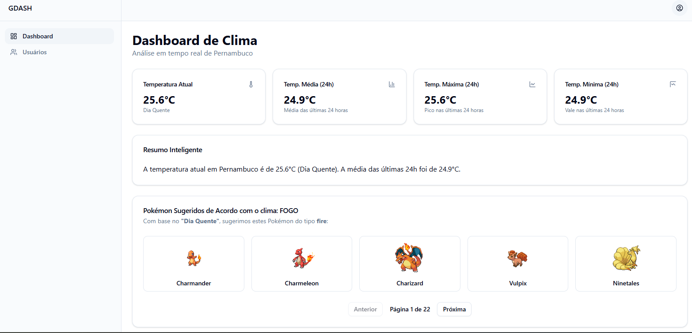

## 📹 Vídeo Explicativo

Assista ao vídeo de apresentação do projeto aqui https://youtu.be/QYFqLirEPIA


# 🌦️ Desafio GDASH 2025/02

Este projeto é uma solução **full-stack** criada para o desafio **GDASH 2025/02**, implementando um pipeline completo de dados climáticos.  
Um serviço em **Python** coleta dados de clima, envia para uma fila **RabbitMQ**, que é processado por um worker em **Go**, armazenado pela **API NestJS + MongoDB**, e exibido em um **dashboard React** com autenticação completa e insights gerados por IA.

---

## 🖥️ Tela Principal

---

## 🚀 Como Executar

É necessário ter **Docker** e **Docker Compose** instalados.

### 1. Clone o repositório
```bash
git clone https://github.com/viniciusbarboosa/gdash-desafiotec
cd gdash-desafiotec
```

### 2. Configure as variáveis de ambiente
Copie o arquivo `.env.example` para `.env` e preencha os valores necessários (por exemplo, a API key de clima).

### 3. Suba todos os contêineres
```bash
docker-compose up --build
```

### 4. Acesse a aplicação (PORTAS PADRÕES)
- **Frontend (Dashboard):** http://localhost:5173  
- **Backend (API):** http://localhost:3000  

---

## 👤 Acesso Padrão / Criar Admin (PORTAS PADRÕES)

Para criar um usuário **Admin**, utilize Postman, Thunder Client ou qualquer ferramenta semelhante.  
Envie um **POST** para a rota:

```
http://localhost:3000/users
```

Com o corpo da requisição:

```json
{
  "name": "Admin GDash",
  "email": "admin@gdash.com",
  "password": "gdash",
  "tipo_usuario": "A"
}
```

Após criar, faça login no Dashboard usando:

- **Email:** admin@gdash.com  
- **Senha:** gdash  

---

