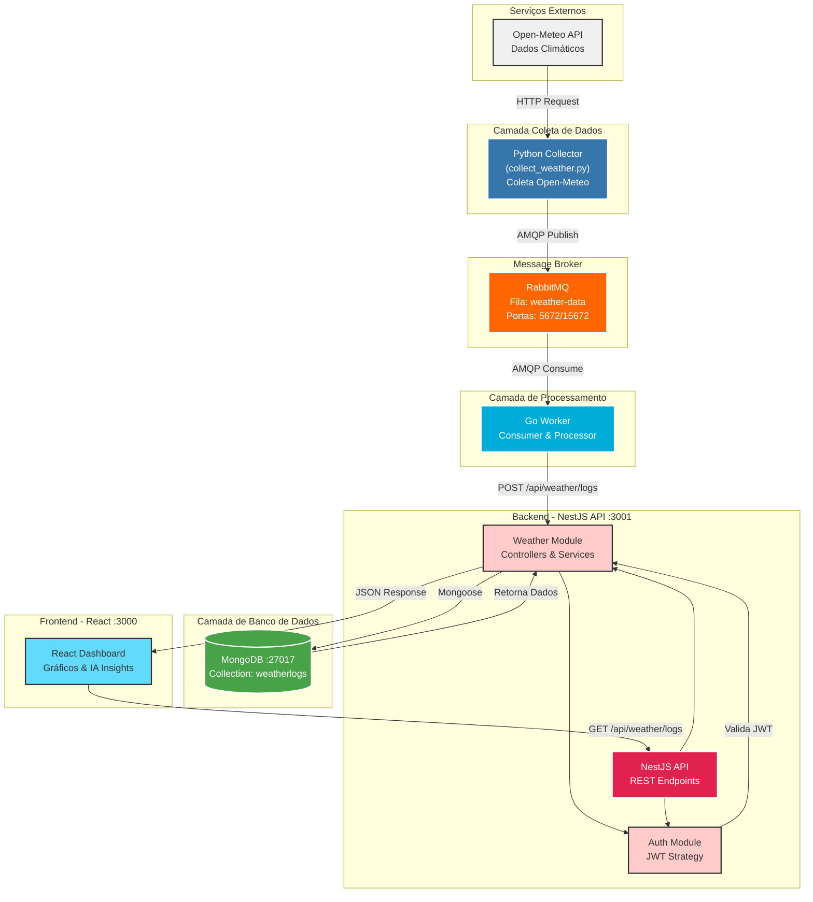

# WeAIther - Weather Monitoring with AI

Sistema full-stack de coleta, processamento e visualização de dados climáticos com insights de IA.
Desenvolvido para o processo seletivo GDASH 2025/02.

## 🛠️ Stack Tecnológica

- **Frontend:** React + Vite + TypeScript + Tailwind CSS + shadcn/ui
- **Backend:** NestJS + TypeScript + MongoDB
- **Worker:** Go + RabbitMQ
- **Collector:** Python
- **Infraestrutura:** Docker Compose

## 📁 Estrutura do Projeto

```
desafio-gdash-2025-02/
├── backend/                    # API NestJS
│   ├── src/
│   │   ├── auth/              # Autenticação JWT
│   │   ├── users/             # CRUD de usuários
│   │   ├── weather/           # Logs climáticos
│   │   ├── insights/          # Insights de IA
│   │   ├── external-api/      # API externa (PokéAPI)
│   │   └── main.ts
│   ├── Dockerfile
│   └── package.json
│
├── frontend/                   # React Dashboard
│   ├── src/
│   │   ├── components/        # Componentes reutilizáveis
│   │   ├── pages/            # Páginas (Login, Dashboard, Users)
│   │   ├── services/         # API clients
│   │   ├── lib/              # Utils e helpers
│   │   └── App.tsx
│   ├── Dockerfile
│   └── package.json
│
├── python-collector/          # Coletor de dados climáticos
│   ├── collect_weather.py    # Script principal
│   ├── requirements.txt
│   └── Dockerfile
│
├── go-worker/                 # Worker de processamento
│   ├── main.go
│   ├── go.mod
│   └── Dockerfile
│
├── docker-compose.yml         # Orquestração de containers
├── .env.example              # Variáveis de ambiente
├── .gitignore
└── README.md
```

## 🏗️ Arquitetura

O sistema segue uma arquitetura baseada em microserviços com processamento assíncrono de mensagens:



## 🚀 Como Rodar

### Pré-requisitos

- Docker e Docker Compose
- Node.js 18+
- Python 3.9+
- Go 1.20+

### Executar com Docker Compose
```bash
# Copiar variáveis de ambiente
cp .env.example .env

# Subir todos os serviços
docker-compose up -d

# Ver logs
docker-compose logs -f
```

### Acessar Aplicação

- **Frontend:** http://localhost:3000
- **API:** http://localhost:3001
- **API Docs (Swagger):** http://localhost:3001/api
- **RabbitMQ Management:** http://localhost:15672 (guest/guest)

### Credenciais Padrão

- **Email:** admin@example.com
- **Senha:** 123456

## 📡 Endpoints Principais da API

### Autenticação
- `POST /api/auth/login` - Login (retorna JWT token)
- `POST /api/auth/register` - Registrar novo usuário

### Usuários
- `GET /api/users` - Listar todos os usuários
- `GET /api/users/:id` - Buscar usuário por ID
- `POST /api/users` - Criar novo usuário
- `PATCH /api/users/:id` - Atualizar usuário
- `DELETE /api/users/:id` - Remover usuário

### Weather (Dados Climáticos)
- `GET /api/weather/logs` - Listar logs climáticos (com paginação)
- `GET /api/weather/logs/:id` - Buscar log específico
- `POST /api/weather/logs` - Criar log (usado pelo Go worker)
- `GET /api/weather/export/csv` - Exportar dados em CSV
- `GET /api/weather/export/xlsx` - Exportar dados em XLSX

### Insights (IA)
- `GET /api/insights` - Listar insights gerados
- `POST /api/insights/generate` - Gerar novos insights
- `GET /api/insights/latest` - Buscar último insight

### External API (Opcional)
- `GET /api/external/items` - Listar itens da PokéAPI (paginado)
- `GET /api/external/items/:id` - Detalhes de um item

**Documentação completa:** http://localhost:3001/api (Swagger)

## 🔧 Rodar Serviços Individualmente

### Backend (NestJS)
```bash
cd backend
npm install
npm run start:dev
# API disponível em http://localhost:3001
```

### Frontend (React)
```bash
cd frontend
npm install
npm run dev
# Frontend disponível em http://localhost:3000
```

### Python Collector
```bash
cd python-collector
pip install -r requirements.txt
python collect_weather.py
```

### Go Worker
```bash
cd go-worker
go mod download
go run main.go
```

**Observação:** Para rodar individualmente, você precisa ter MongoDB e RabbitMQ rodando localmente ou via Docker:
```bash
# Subir apenas MongoDB e RabbitMQ
docker-compose up mongodb rabbitmq -d
```

## 🐛 Troubleshooting

### Porta já em uso
Se você receber erro de porta ocupada:
```bash
# Verificar processos usando a porta
# Windows
netstat -ano | findstr :3000
netstat -ano | findstr :3001

# Parar o Docker Compose e tentar novamente
docker-compose down
docker-compose up -d
```

### Docker não sobe todos os containers
```bash
# Ver logs de todos os serviços
docker-compose logs

# Verificar status dos containers
docker-compose ps

# Recriar containers
docker-compose down
docker-compose up -d --build
```

### Erro de conexão com MongoDB
- Verifique se o MongoDB está rodando: `docker-compose ps mongodb`
- Confira a variável `MONGODB_URI` no `.env`
- Aguarde alguns segundos após subir os containers (MongoDB demora para iniciar)

### RabbitMQ não recebe mensagens
- Acesse o Management UI: http://localhost:15672
- Verifique se a fila `weather-data` existe
- Confira logs do Python collector: `docker-compose logs python-collector`
- Confira logs do Go worker: `docker-compose logs go-worker`

### Frontend não conecta na API
- Verifique a variável `VITE_API_URL` no `.env`
- Confira se o backend está rodando: http://localhost:3001/api
- Limpe o cache do navegador e recarregue a página

### "npm install" falha
```bash
# Limpar cache do npm
npm cache clean --force

# Deletar node_modules e reinstalar
rm -rf node_modules package-lock.json
npm install
```

## 📹 Vídeo Explicativo

_Link será adicionado após finalização_