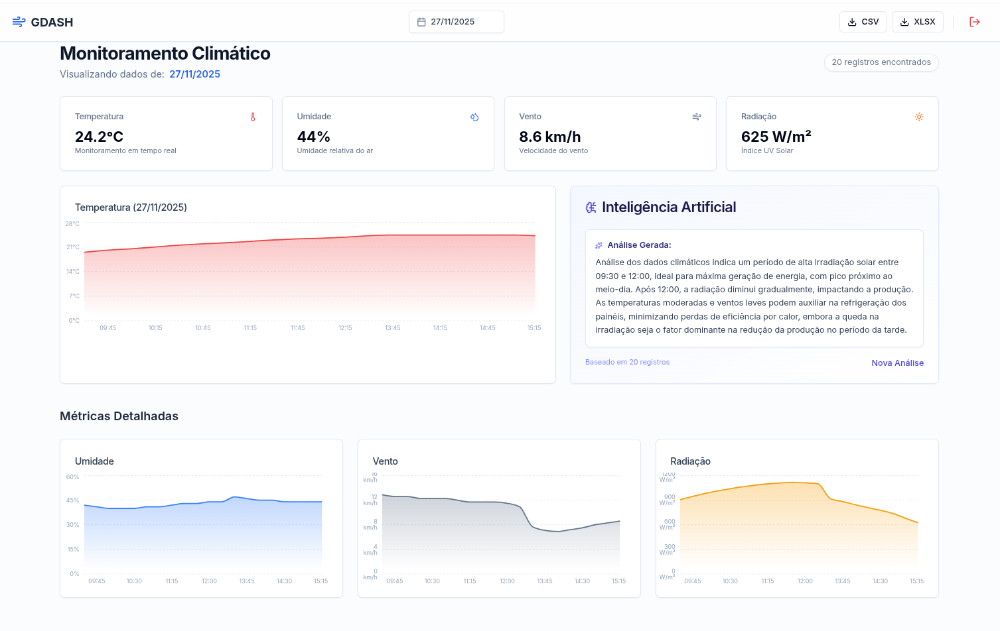
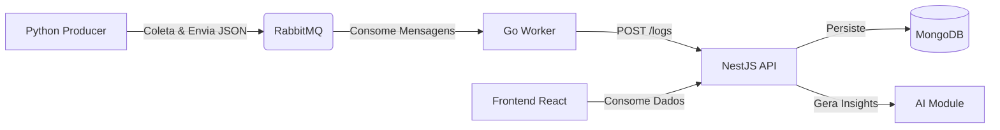

# GDASH 2025/02 - Full Stack Weather Challenge

Solução desenvolvida para o processo seletivo GDASH 2025/02. Uma aplicação Full Stack moderna orientada a eventos, integrando múltiplas linguagens (Python, Go, TypeScript) e serviços para monitoramento climático e geração de insights com IA.

## 📸 Dashboard


## 📹 Demonstração (Vídeo)

> **[Clique aqui para assistir ao vídeo explicativo da arquitetura e funcionamento](https://youtu.be/TlMmacwQlFg)**

---

## 🏛️ Arquitetura da Solução

O sistema foi desenhado seguindo uma arquitetura de microsserviços e processamento assíncrono:



### Fluxo de Dados:

1. **Python Producer**: Coleta dados climáticos periodicamente (Open-Meteo) e publica na fila.
2. **RabbitMQ**: Atua como broker de mensagens, garantindo desacoplamento.
3. **Go Worker**: Consome a fila, processa os dados e os envia para a API.
4. **Backend (NestJS)**: Gerencia regras de negócio, autenticação (JWT), usuários, persistência no MongoDB e geração de insights de IA.
5. **Frontend (React)**: Dashboard interativo para visualização de dados e gerenciamento de usuários.

## 🚀 Tecnologias Utilizadas

- **Frontend**: React, Vite, TailwindCSS, shadcn/ui.
- **Backend**: NestJS (TypeScript), Mongoose.
- **Worker**: Go (Golang).
- **Producer**: Python.
- **Banco de Dados**: MongoDB.
- **Mensageria**: RabbitMQ.
- **Infraestrutura**: Docker & Docker Compose.

## 📂 Estrutura do Projeto

A estrutura de diretórios reflete a separação de responsabilidades:

- `/backend` - API principal em NestJS (Módulos: Auth, Users, Weather, AI-Insight).
- `/frontend` - Interface do usuário (Dashboard, Login).
- `/go-worker` - Worker consumidor da fila RabbitMQ.
- `/python-producer` - Script de coleta de dados climáticos.
- `docker-compose.yml` - Orquestração de todos os serviços.

## ⚙️ Como Executar

### Pré-requisitos
- Docker e Docker Compose instalados.

### Passo a Passo

1. **Clone o repositório:**
```bash
git clone [LINK_DO_REPOSITORIO]
cd REPOSITORIO
```
2. **Configuração de Variáveis de Ambiente:** Duplique o arquivo de exemplo e renomeie para `.env`:
```bash
cp .env.example .env
```
3. **Atualize a GEMINI KEY**
- Acesse: [https://aistudio.google.com/](https://aistudio.google.com/)
- Faça login com sua conta Google.
- Vá em "Get API Key" / "Obter chave da API"
- No menu lateral, clique em “**API Keys**” → “**Create API Key**”.
- Escolha o **projeto** (ou crie um novo).
- Copie a chave e coloque no `.env` em **GEMINI_API_KEY**
4. **Subir a aplicação:** Execute o comando abaixo na raiz do projeto para construir e iniciar todos os containers:
```bash
docker-compose up --build
```
5. **Acessar a Aplicação:**
- **Frontend (Dashboard)**: [http://localhost:5173](http://localhost:5173).   
    🔐 **Login Padrão**:
    - Email: admin@example.com
    - Senha: 123456
- **Backend (API)**: [http://localhost:3000](http://localhost:3000)
- **RabbitMQ Management**: [http://localhost:15672](http://localhost:15672).   
    🔐 **Login Padrão**:
    - Username: guest
    - Password: guest

## 📚 Documentação da API

### Autenticação
- `POST /api/auth/login` - Autentica usuário e retorna token JWT.

### Clima (Weather)
- `GET /api/weather/logs` - Lista logs climáticos (suporta filtro `?date=YYYY-MM-DD`).
- `GET /api/weather/insight-now` - Gera análise de IA com base nos dados climáticos (suporta filtro `?date=YYYY-MM-DD`).
- `GET /api/weather/export.csv` - Exporta dados em formato CSV.
- `GET /api/weather/export.xlsx` - Exporta dados em formato Excel (XLSX).

### Usuários (CRUD)
- `POST /api/users` - Cria um novo usuário.
- `GET /api/users` - Lista todos os usuários.
- `GET /api/users/:id` - Busca um usuário pelo ID.
- `PATCH /api/users/:id` - Atualiza dados de um usuário.
- `DELETE /api/users/:id` - Remove um usuário.

## ✅ Funcionalidades Implementadas

- **Coleta de Dados**: Script Python buscando dados reais de clima.
- **Fila de Processamento**: Integração robusta via RabbitMQ.
- **Worker de Alta Performance**: Processamento de mensagens em Go.
- **API Restful**: NestJS com arquitetura modular.
- **Autenticação**: Sistema de Login e Proteção de Rotas (JWT).
- **IA Insights**: Geração de análises inteligentes baseadas no clima.
- **Exportação**: Download de dados em CSV/XLSX.
- **Dashboard**: Interface moderna e responsiva.


Desenvolvido por Walter Melhado Arbiol Forne -> [LinkedIn](https://www.linkedin.com/in/walter-melhado-arbiol-forne-818656211/)