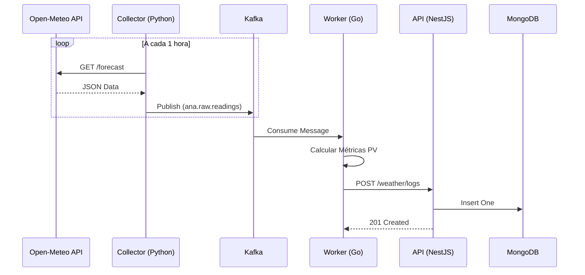

# Arquitetura do Sistema

## Visão Geral

O GDASH é composto por quatro microsserviços principais, orquestrados via Docker Compose. A arquitetura privilegia o desacoplamento, escalabilidade e robustez.

## Componentes

### 1. Collector (Python)
*   **Responsabilidade:** Coletar dados meteorológicos brutos de fontes externas (atualmente Open-Meteo).
*   **Tecnologia:** Python 3.11, Requests.
*   **Saída:** Publica mensagens JSON no tópico Kafka `ana.raw.readings`.
*   **Agendamento:** Executa a cada 1 hora (configurável).

### 2. Worker (Go)
*   **Responsabilidade:** Processamento de alto desempenho e validação de dados.
*   **Tecnologia:** Go 1.21, Sarama (Kafka Client).
*   **Entrada:** Consome do tópico `ana.raw.readings`.
*   **Processamento:** Calcula métricas como irradiância solar estimada e fatores de perda (derating) para sistemas fotovoltaicos.
*   **Saída:** Envia dados processados para a API NestJS via HTTP.

### 3. API (NestJS)
*   **Responsabilidade:** Backend central, regras de negócio, autenticação e persistência.
*   **Tecnologia:** Node.js, NestJS, Mongoose.
*   **Banco de Dados:** MongoDB v5 (armazenamento de logs, usuários e insights).
*   **Autenticação:** JWT (JSON Web Tokens).
*   **Funcionalidades:**
    *   Gestão de Logs de Clima.
    *   Geração de Insights (IA).
    *   CRUD de Usuários.
    *   Exportação de Dados (CSV/XLSX).

### 4. Frontend (React)
*   **Responsabilidade:** Interface do usuário e dashboard interativo.
*   **Tecnologia:** React, Vite, TypeScript, TailwindCSS, ShadCN/UI.
*   **Build:** Nginx (imagem de produção).

## Infraestrutura

*   **Message Broker:** Kafka (confluentinc/cp-kafka) + Zookeeper.
*   **Banco de Dados:** MongoDB v5.
*   **Orquestração:** Docker Compose.

## Diagrama de Sequência (Fluxo Típico)

