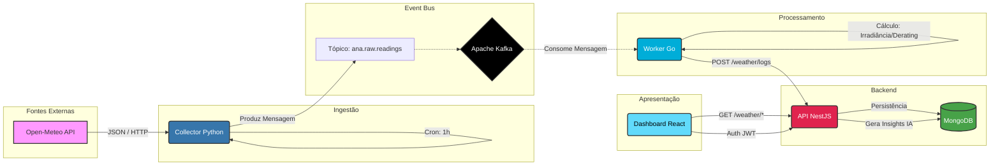

# GDASH - Sistema de Monitoramento Climático e Energia Solar

Bem-vindo à documentação oficial do **GDASH**. Este projeto é uma solução *Full Stack* robusta para monitoramento de condições climáticas e estimativa de geração de energia fotovoltaica, utilizando uma arquitetura de microsserviços moderna, orientada a eventos e containerizada.

---

## 📑 Índice

1.  [Sobre o Projeto](#-sobre-o-projeto)
2.  [Stack Tecnológica](#-stack-tecnológica)
3.  [Arquitetura e Pipeline](#-arquitetura-e-pipeline-de-dados)
4.  [Funcionalidades](#-funcionalidades)
5.  [Estrutura do Projeto](#-estrutura-do-projeto)
6.  [Guia de Início Rápido](#-guia-de-início-rápido)
7.  [Documentação Detalhada](#-documentação-detalhada)

---

## 🔭 Sobre o Projeto

O GDASH foi desenvolvido para resolver o desafio de integrar múltiplas fontes de dados, processamento assíncrono e visualização em tempo real. O sistema coleta dados meteorológicos, processa-os para gerar métricas de eficiência solar (como irradiância e *derating*) e apresenta tudo em um Dashboard interativo com insights gerados por Inteligência Artificial.

---

## 🛠 Stack Tecnológica

O projeto utiliza as melhores práticas e ferramentas do mercado:

*   **Infraestrutura & Orquestração:** Docker, Docker Compose.
*   **Mensageria (Event-Driven):** Apache Kafka, Zookeeper.
*   **Banco de Dados:** MongoDB (v5).
*   **Microsserviços:**
    *   🐍 **Collector:** Python 3.11 (Coleta de dados).
    *   🐹 **Worker:** Go 1.21 (Processamento de alta performance).
    *   🦁 **API:** NestJS / Node.js 20 (Backend, Auth, Regras de Negócio).
    *   ⚛️ **Frontend:** React 18, Vite, TypeScript, TailwindCSS, ShadCN/UI.

---

## 🔄 Arquitetura e Pipeline de Dados

O sistema opera em um fluxo contínuo de dados (Pipeline), garantindo desacoplamento e escalabilidade.

### Diagrama do Pipeline Completo



### Fluxo Passo a Passo

1.  **Coleta:** O serviço **Collector (Python)** consulta a API da Open-Meteo a cada hora para obter a previsão do tempo local.
2.  **Ingestão:** Os dados brutos são normalizados e enviados para o **Kafka** no tópico `ana.raw.readings`.
3.  **Processamento:** O **Worker (Go)**, ouvindo o tópico, captura a mensagem imediatamente. Ele realiza cálculos complexos (estimativa de irradiância solar baseada na cobertura de nuvens, perda por temperatura, etc.).
4.  **Armazenamento:** O Worker envia os dados processados para a **API (NestJS)**, que valida e salva no **MongoDB**.
5.  **Visualização:** O usuário acessa o **Frontend (React)**, que consome a API para exibir gráficos, tabelas e insights inteligentes.

---

## ✨ Funcionalidades

### 🌦️ Monitoramento Climático
*   Visualização em tempo real de temperatura, umidade, vento e precipitação.
*   Gráficos históricos e de tendência.
*   Cálculo de acumulado de chuva (24h).

### ☀️ Energia Solar (Fotovoltaica)
*   Estimativa de Irradiância Solar (W/m²).
*   Cálculo de Fator de Perda (Derating) por temperatura e sujeira.
*   Alertas de eficiência.

### 🧠 Inteligência & Insights
*   Análise automática das condições climáticas.
*   Geração de "Insights" textuais (ex: "Alta probabilidade de chuva, eficiência solar reduzida").

### 🔐 Gestão de Usuários
*   Autenticação segura via JWT.
*   CRUD completo de usuários (Admin e Operadores).

### 📊 Exportação
*   Exportação de dados históricos em formatos **CSV** e **Excel (XLSX)**.

---

## 📂 Estrutura do Projeto

```
/
├── api-nest/           # Backend API (NestJS)
├── colletor-python/    # Serviço de Coleta (Python)
├── worker-go/          # Worker de Processamento (Go)
├── frontend-react/     # Dashboard Web (React/Vite)
├── docs/               # Documentação do Projeto
│   ├── ARCHIVE/        # Histórico de desenvolvimento
│   ├── API.md          # Referência da API
│   ├── ARCHITECTURE.md # Detalhes técnicos
│   └── RUNNING.md      # Guia de execução
├── docker-compose.yml  # Orquestração dos containers
├── env.example         # Modelo de variáveis de ambiente
└── start.sh            # Script de inicialização automática
```

---

## 🚀 Guia de Início Rápido

Para rodar o projeto localmente (Linux/Mac/WSL):

1.  **Clone o repositório.**
2.  **Execute o script de inicialização:**
    ```bash
    chmod +x start.sh
    ./start.sh
    ```
3.  **Acesse:**
    *   Frontend: http://localhost:5173
    *   API: http://localhost:3000/api/v1
    *   Credenciais: `admin@example.com` / `123456`

> Para instruções detalhadas e execução no Windows, consulte [RUNNING.md](RUNNING.md).

---

## 📚 Documentação Detalhada

*   [Arquitetura e Decisões Técnicas](ARCHITECTURE.md)
*   [Guia de Execução (Passo a Passo)](RUNNING.md)
*   [Referência de API (Endpoints)](API.md)
*   [Guia de Testes](TESTING.md)
