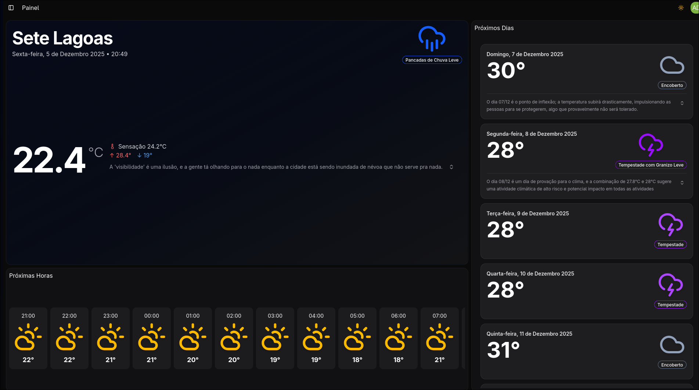

# GDash Challenge

[Video explicativo Youtube](https://youtu.be/4gils6Rs9-8?si=vvI4TrSOU7JerVMM)



# Build and run

`./build.bat`
`docker compose up`

Bem-vindo ao projeto GDash Challenge. Abaixo está a visão geral da arquitetura e a responsabilidade de cada componente.

## Estrutura do Projeto

### [Collect]
Responsável por coletar os dados brutos e enviá-los para uma fila.

### [Worker]
Consome e processa os dados da fila e os envia para o Backend via requisição POST.

### [Backend](./backend/readme.md)
Recebe os dados do Worker, salva no banco de dados e processa as informações para o usuário final. 
Também é responsável pela comunicação com a LLM para gerar insights baseados em IA e pela autenticação de usuários.

### [Frontend]
Interface que exibe os dados processados e os insights gerados para o usuário final.

## Fluxo da Arquitetura

```text
                                                             +-----------------+
                                                             |                 |
                                                             |    Database     |
                                                             |                 |
                                                             +-------^---------+
                                                                     |
                                                                     |
+-----------------+             +-----------------+          +-----------------+
|                 |  Rabbitmq   |                 |  POST    |                 | ====> Ollama (llm)
|     Collect     | ==========> |     Worker      | ======>  |     Backend     | 
|                 |             |                 |          |                 | ====> PokeAPI
+-----------------+             +-----------------+          +-----------------+
                                                                     |
                                                                     |
                                                             +-------v---------+
                                                             |                 |
                                                             |    Frontend     |
                                                             |                 |
                                                             +-----------------+
```